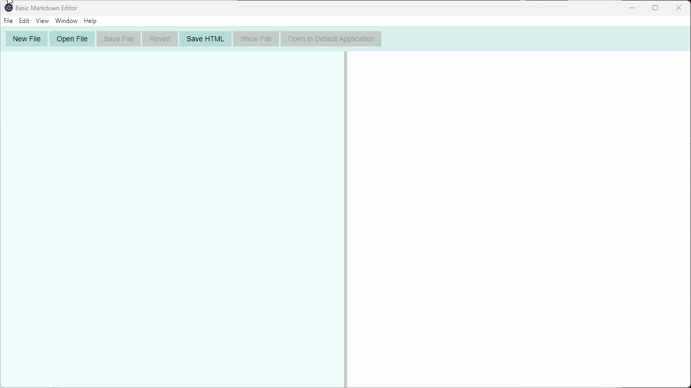

# Markdown Editor

This basic markdown editor application is part of the `Electron In Action` curriculum.

## v0.1

### Requirements

* [REQ1] Markdown pages can be rendered as HTML.
* [REQ2] Markdown editor and HTML preview is synchronized automatically.
* [REQ3] Markdown editor inputs are sanitized from harmful inputs.
* [REQ4] A use can adjust the page column width for Markdown editor and HTML preview.

### Design

|  |
| :---: |
| v0.1 wireframe |

### Demo

## v0.2

### Requirements

* [REQ5] A user can open files from the file system.
* [REQ6] A user can save the changes to the file back to the file system.
* [REQ7] Rendered HTML can be exported.
* [REQ8] Rendered HTML can be copied to clipboard.