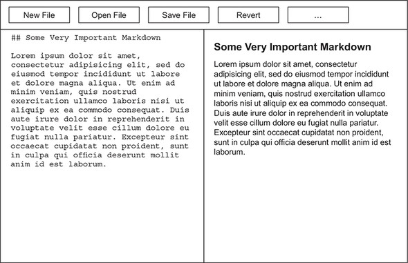

# Markdown Editor

This basic markdown editor application is part of the `Electron In Action` curriculum.

## v0.1

### Requirements

1. A user can open files from the file system.
2. A user can save the changes to the file back to the file system.
3. Markdown pages can be rendered as HTML:
4. Rendered HTML can be exported.
5. Rendered HTML can be copied to clipboard.

### Design

|  |
| :---: |
| v0.1 wireframe |
